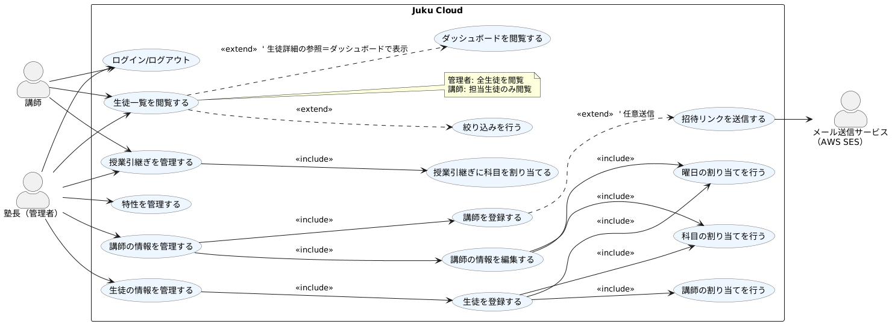
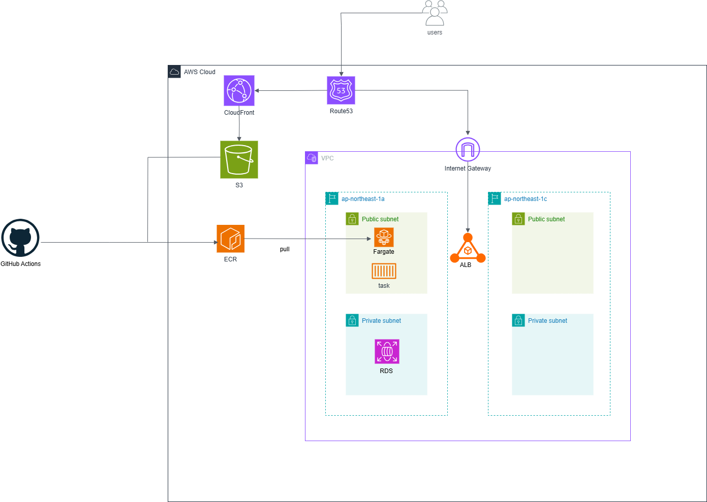
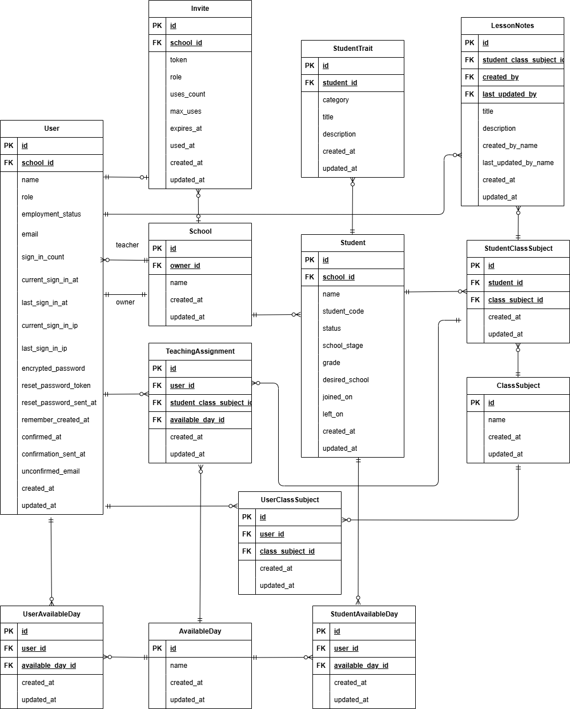

# Juku Cloud

サービスURL: https://www.juku-cloud.com
- フロントエンド: https://github.com/Taira0222/juku-cloud-frontend
- バックエンド: https://github.com/Taira0222/juku-cloud-backend


---

### 生徒一人一人の特性をクラウドで管理できる
個別指導塾を運営するうえで、特に生徒の特性を把握し指導することは非常に重要です。これらは講師たちが潜在的に意識していますが、言語化されることなく属人的なものになりがちです。Juku Cloudは生徒の特性を「いい特性」、「注意する特性」に分類し、クラウド上で一元管理することで、講師間での情報共有を促進し、生徒一人一人に最適な指導を提供することができます。

## 開発背景
私はソフトウェアエンジニアを目指す前、3年間にわたり個別指導塾を経営していました。
学習塾では受験対策や成績向上が最重要ですが、それ以上に、生徒一人ひとりの特性を把握し、最適な指導を行うことが欠かせません。
例えば、理解が不十分でも「わかった」と言ってしまう生徒がいました。そのような生徒には、段階的に理解度を確認しながら教える必要がありました。
一方で、理解力が高く、基礎でつまずかない生徒もいます。その場合は、他の生徒と同じペースではなく、応用的な内容まで進めることで、さらなる成長を促せました。
しかし、こうした「生徒の特性を踏まえた指導」は多くの場合、講師の経験に依存して属人化していました。その結果、情報共有が難しく、指導の質にばらつきが生じていました。
この課題を解決するために開発したのが Juku Cloud です。
Juku Cloudは、生徒の特性を「良い特性」と「注意が必要な特性」に分類し、クラウド上で一元管理します。これにより講師間の情報共有が容易になり、生徒一人ひとりに最適な指導を提供できます。
さらに、授業の引き継ぎ事項を科目ごとに管理できるため、引き継ぎにかかる時間を大幅に削減し、より教育そのものに集中できる環境を実現します。

## ペルソナ
### 対象 1: A さん（塾長・45歳）

- 生徒数：50名の個別指導塾を運営
- ITリテラシー：Excelは使用できるが、SaaS導入経験はなし
- 主な課題：講師5名を雇っているが、生徒の特性や指導方針が属人化しており、授業の質にばらつきがある
- ゴール：品質を維持しながら2教室目を開校したい
- Juku Cloudでの解決：生徒特性や引継ぎ情報をクラウドで共有し、誰が教えても一定品質の指導を実現

### 対象 2: B さん（新規オーナー・30歳）

- 生徒数：20名
- ITリテラシー：Google Driveで資料管理している
- 主な課題：生徒情報が自分の頭の中にあり、アルバイト講師に共有できないため雇用拡大に踏み切れない
- ゴール：講師を採用して1年以内に生徒50名へ拡大したい
- Juku Cloudでの解決：生徒情報を体系的に管理し、引継ぎや方針共有をスムーズにすることで人材育成を効率化

### 対象 3: C さん（大学生講師・20歳）

- 所属：個別指導塾でアルバイト講師として勤務
- ITリテラシー：Google WorkspaceやMicrosoft Officeを日常的に使用
- 主な課題：塾長からの指示が口頭中心で抽象的、生徒ごとの対応に迷うことがある
- ゴール：生徒ごとの注意点や過去の引継ぎを確認し、安心して授業に臨みたい
- Juku Cloudでの解決：特性・引継ぎ情報をリアルタイムに参照でき、授業前の不安を軽減

---

## 主な機能(MVP)

- 管理者・講師の2つの権限
- 生徒管理機能
- 講師管理機能
- 生徒の特性管理機能
- 授業の引き継ぎ事項管理機能

### ユースケース図



### 管理者・講師の2つの権限
ここには、gifを使用してUIを用いた説明を加える
### 生徒管理機能

### 講師管理機能

### 生徒の特性管理機能

### 授業の引き継ぎ事項管理機能

---

## アーキテクチャ概要

Juku Cloudは、フロントエンドとバックエンドを分離したSPA構成のWebアプリケーションです。

- フロントエンド：React + Vite + TypeScript で構築し、S3 + CloudFrontでホスティング。
- バックエンド：Rails 8（APIモード）をECS Fargate上で稼働させ、RDS（PostgreSQL）と接続。
- 認証：devise token auth によるトークン認証を採用。
- CI/CD：GitHub ActionsでECRへのビルド・プッシュ、ECSへのデプロイを自動化。
- インフラ：ECS / RDS / S3 / CloudFront / Route53 / ACM / ALB / Secrets Manager / CloudWatch を利用。

### SPA構成の採用理由

#### UX面
- ペルソナはITリテラシーが高くないため、直感的に操作できるUI/UXが求められる。
- ページ遷移を減らし、一覧→詳細→編集をスムーズに行えるようSPA構成を採用。

#### 技術面
- フロントエンドをReact、バックエンドをRails APIとして分離することで、
  将来的にモバイルアプリなど他クライアントからもAPIを再利用しやすい。
- 静的アセット（S3+CloudFront）で配信し、ハッシュ付き`assets`の長期キャッシュ・
  `index.html`の短期キャッシュを分離管理できる。

#### 運用面
- サーバー側でビューを描画しないため、ECSタスクの負荷が軽減し、コスト面でも有利。

### アーキテクチャー図(概要)

```

[ユーザーのブラウザ]
       ↓
 [CloudFront (S3静的ホスティング)]
       ↓
 [React Frontend]  →  [Rails API (ECS Fargate)]
                                ↓
                         [RDS (PostgreSQL)]

```
---

## 技術スタック
| カテゴリ	技術          |                                                                                             | 
| ---------------------- | ------------------------------------------------------------------------------------------- | 
| フロントエンド         | React 19.2.0 / Vite 7.0.4 / TypeScript 5.8.3                                                | 
| バックエンド           | Ruby 3.4.4 / Ruby on Rails 8.0.3（APIモード）                                               | 
| データベース           | PostgreSQL 15.14                                                                            | 
| 認証                   | devise token auth 1.2                                                                       | 
| 環境構築               | Docker,Devcontainer                                                                         | 
| CI/CD	                 | Github Actions(CloudFront/S3, ECR/ECSデプロイ, OIDC認証）                                   | 
| インフラ               | AWS(ECS / ECR / RDS / CloudFront / S3 / Route53 / ACM / ALB / Secrets Manager / CloudWatch) | 
| テスト                 | Vitest / Testing Library / MSW / RSpec / SimpleCov                                          | 
| 静的解析               | ESLint / Prettier / RuboCop / Bullet / Bundler Audit                                       | 
| その他(フロントエンド) | Tailwind CSS / Shadcn UI / Zustand / TanStack Query / Zod /                | 
| その他(バックエンド)   | Kaminari / Alba / Letter Opener Web                                  | 

### フロントエンド
#### React
- 既存プロジェクトに導入するわけでもなく、これから事業として作ってくアプリで長期視点で安定版ではなく、最新のバージョンを採用しました。
- 高速なビルド・開発環境を提供するViteを採用し、ReactでコンポーネントベースのUIを構築。
- SPAを導入するうえでVueも検討しましたが、以下の点でReactを選択しました。
  - Tailwind CSSとの親和性が高く、UIライブラリ系(shadcn/uiなど)が充実している。
  - TypeScriptとの親和性が高く、型安全な開発がしやすい。
#### Vite
- React Create Appは公式から非推奨となり、Viteが主流となっていることから採用の検討を開始しました。
- React 公式に書いてあるほかのビルドツール(Parcel,Rsbuildなど)と比較してもViteが最も高速であり、`Vitest`との相性もいいため採用しました。
#### TypeScript
- 型安全なコードを書くことで、バグの早期発見・保守性向上を図るために採用しました。
- Zodと組み合わせて、APIレスポンスのバリデーションと型定義を一元管理できます

### バックエンド
#### Ruby
- 長期運用を見据え、安定性よりも将来性を重視して最新バージョンを採用しました。
- 日本で開発された言語ということもあり、ほかの言語と比べて学習コストが低く、個人開発に適していると判断しました。
- オブジェクト指向言語であり、責任分割や設計パターンを適用しやすい点も評価しました。
#### Ruby on Rails (APIモード)
- RailsはRubyの代表的なWebフレームワークで、豊富なライブラリ・コミュニティが存在するため採用しました。
- APIモードを採用することで、フロントエンドとバックエンドを分離し、将来的にモバイルアプリなど他クライアントからもAPIを再利用しやすい構成としました。

### データベース
#### PostgreSQL
MySQLも検討しましたが、以下の理由でPostgreSQLを採用しました。
- 今後の拡張性を考えて、PostgreSQLの方が高度な機能が多く、柔軟なデータ操作が可能。
- 生徒、講師、引継ぎ事項、科目、生徒の特性など、複数テーブルにまたがる整合性が非常に重要であり、PostgreSQLの堅牢なトランザクション管理が有利。
- MySQLの素早い動作よりも、PostgreSQLの正確で壊れないデータ構造の方が重要と判断。

### 認証
#### devise token auth
- `devise_token_auth` を採用し、`access-token` / `client` / `uid` を `LocalStorage`に保持しています。  
- Axios インターセプタで各リクエスト時にヘッダへ付与し、レスポンスヘッダに含まれる新しいトークンを用いてローテーションを行います。  
- サーバ側にセッションを保持しないため Rails APIモードに最適 であり、Cookieベースの認証と比較して CSRF攻撃のリスクを低減 できます。  
- 一方で LocalStorage は XSS に弱いため、CloudFront で CSP（Content Security Policy）を設定して外部スクリプト実行を制限しています。  
  詳細は [こちら](https://github.com/Taira0222/juku-cloud?tab=readme-ov-file#%E3%82%BB%E3%82%AD%E3%83%A5%E3%83%AA%E3%83%86%E3%82%A3) を参照。


### 環境構築
#### Docker
- 開発環境と本番環境の差異を最小化し、一貫した動作環境を提供するために採用しました。  
- Docker Compose により、Rails・PostgreSQL・React の各サービスをコンテナで統合管理。  
- チーム開発時も `docker compose up` だけで環境を再現可能です。
#### Devcontainer
- VS Code 上で自動的に開発環境を構築できるよう、Devcontainer を導入しました。  
- Ruby や Node.js、AWS CLI などをあらかじめイメージに含め、セットアップの手間を最小化しています。
- コンテナ起動時もコマンドが不要で、「コンテナを再度開く」だけで開発環境にアクセスできます。

### CI/CD
#### Github Actions
- GitHub Actions を採用し、コードの変更を自動的にビルド・テスト・デプロイするワークフローを構築しました。  
- バックエンドは ECR への Docker イメージのビルド・プッシュ、ECS へのデプロイ、DBのmigrateを自動化。  
- フロントエンドは S3 へのビルド済みアセットのデプロイと CloudFront キャッシュの最適化を自動化。
### インフラ
#### AWS
- 無料のRenderも検討しましたが、豊富なサービスと高い拡張性を持つAWSを採用しました。
- それぞれのサービスの選定理由については [こちら](https://github.com/Taira0222/juku-cloud?tab=readme-ov-file#%E5%85%A8%E4%BD%93%E3%81%AE%E6%A7%8B%E6%88%90%E3%81%AE%E6%A6%82%E8%A6%81) を参照してください。
### テスト
#### Vitest, Testing Library, MSW
- Jestも検討しましたが、Viteとの親和性が高く、高速なVitestを採用しました。
- React Testing Library、MSWを組み合わせて、単体テストだけではなく、APIモックを利用した結合テストも実施しています。
#### RSpec / SimpleCov
- 以前作成したTodo アプリではMinitestを採用しましたが、テストの網羅性を高めるためにRSpecを採用しました。
- SimpleCovを導入し、コードカバレッジを測定。目標カバレッジ80%以上を設定しています。
### 静的解析
#### ESLint / Prettier
- ESLint と Prettier を組み合わせて、コードの一貫性と可読性を確保しています。
#### RuboCop / Bullet / Bundler Audit
- RuboCopを導入し、コードスタイルと品質を自動的にチェックしています。
- Bullet を導入し、N+1クエリなどのパフォーマンス問題を検出。
- Bundler Audit を使用して、依存関係の脆弱性を定期的にチェックしています。
### その他(フロントエンド)
#### Tailwind CSS
- Shadcn UI を利用するために Tailwind CSS を採用しました。
#### Shadcn UI
- Tailwind CSS をベースにしたコンポーネントライブラリで、今回のような業務アプリに適したUIコンポーネントが豊富に揃っているため採用しました。
#### Zustand
- Context API よりもシンプルなグローバルステート管理が可能で、`useState`ライクな書き方で直感的に扱えて学習コストが低いため採用しました。
#### TanStack Query
- サーバー状態の管理が容易で、データフェッチング・キャッシュ・同期化・更新を効率的に行えるため採用しました。
#### Zod
- バックエンドだけでなく、フロントエンドでもバリデーションを一元管理できるため、一部のスキーマ定義に採用しました。
### その他(バックエンド)
#### Kaminari
- ページネーションを非常に簡単に実装できることがとても魅力的であったため採用しました。
```ruby
# page = params[:page] 
# per_page = params[:per_page] 
students.preload(ASSOCS).order(:id).page(page).per(per_page)
```
#### Alba
- 最初は自作のシリアライザを使用していましたが、Albaを採用することでAPIレスポンスのスキーマを統一的に管理できるようになりました。
#### Letter Opener Web
- 開発環境でメール送信をブラウザ上で確認できるため、採用しました。本番ではSESを使用しています。


---

## ディレクトリ構成
### フロントエンド

```
juku-cloud-frontend/
└─ src/
   ├─ Router/                 # ルーティング/認可（AuthRoute, ProtectedRoute, RoleRoute など）
   ├─ pages/                  # 画面コンポーネント（URL単位）
   ├─ features/               # 機能ごとの内包（auth / students / studentTraits / lessonNotes / teachers ...）
   │  └─ lessonNotes/         # ←代表例
   │     ├─ api/              # API呼び出し
   │     ├─ components/       # フォーム・ダイアログ・テーブル等のUI
   │     ├─ hooks/            # 機能固有のロジック（フォーム状態など）
   │     ├─ mutations/        # TanStack Query のミューテーション
   │     ├─ queries/          # TanStack Query のクエリ
   │     ├─ constants/ key.ts # 定数/クエリキー
   │     ├─ types/            # 型定義（Zod/TS）
   │     └─ test/             # この機能のユニット/結合テスト
   ├─ components/             # 共通UI（shadcn/ui ラップや共通フォーム部品）
   ├─ stores/                 # Zustand ストア
   ├─ queries/                # グローバル汎用クエリ（例：useUserQuery）
   ├─ mutations/              # グローバル汎用ミューテーション（例：useSignOut）
   ├─ api/                    # グローバルAPI（例：userApi, signOutApi）
   ├─ lib/                    # axiosクライアント、エラーハンドラ等の基盤
   ├─ utils/                  # フォーマッタ等のユーティリティ
   └─ tests/                  # MSWサーバ/fixtures、E2E寄りの統合テスト


```

### バックエンド

```
juku-cloud-backend/
├─ app/
│  ├─ controllers/           
│  │  ├─ concerns/           # 共通処理(エラー、認証など)
│  │  └─ v1/                 # APIエンドポイント（V1名前空間＋認証系）
│  ├─ models/                # ドメインモデル（subjects/availability/teaching で責務分割）
│  ├─ queries/               # 検索・一覧用のQueryオブジェクト
│  ├─ serializers/           # APIレスポンスのスキーマ統一（Alba）
│  └─ services/              # 変更を伴うユースケース処理（作成/更新/検証）
├─ config/
│  ├─ environments/          # 環境別設定
│  └─ initializers/          # devise/cors/bullet 等の初期化
├─ db/                       
│  └─ migrate/               # マイグレーション一式
├─ ecs/
│  └─ taskdef.json           # ECSタスク定義（CIでレンダリング）
└─ spec/
   ├─ requests/              # APIリクエストのE2E寄りテスト
   ├─ models/                # バリデーション/関連
   └─ services/              # ユースケース単位の検証

```

---
## インフラ構成図



### 全体の構成の概要
本構成は「フロントエンド（静的ホスティング）」「バックエンド（APIサーバー）」「データベース（RDS）」をAWS上で分離し、CI/CDによりGitHub Actionsから自動デプロイ可能なモダンな構成としています。

セキュリティ・スケーラビリティ・コストのバランスを意識し、最小構成で本番運用に耐えうる設計としています。

### VPC設計
- Public Subnet: ALB・Fargateを配置（外部通信が必要）。
- Private Subnet: RDSを配置し、インターネット非公開。
- Internet Gatewayを介して外部通信を確保。
- NAT未設置のため、ECSタスクの外部通信はALBを経由。

### AZ / リージョン
- 想定ユーザーは日本国内のため、東京リージョンを選択しました。
- アメリカ在住のため、将来的には米国リージョンにもデプロイすることを検討しています。
- AZ が複数あるのはALBを設置するために必要だからで、ECSタスクやRDSは単一AZに配置しています。

### Fargate
- EC2管理不要で（OSパッチ/容量管理が不要）、オートスケールやローリング更新が容易で運用負荷が低い。実務でも採用事例が多いことから、コストをかけてでも習得する価値があると判断し採用しました。
- 今回はコスト面からNATゲートウェイを設置しておらず、ECSタスクがインターネットにアクセスする必要がある場合は、ALB経由で通信しています。
- OIDC(OpenID Connect)認証により、ECSタスクがSecrets ManagerやECRに安全にアクセス可能。IAMロールを細かく分割でき、セキュリティが向上。

### ECR
- プライベートDockerレジストリとしてGitHub Actionsからビルド済みイメージをpushし、ECSがpullするワークフローが標準的であるため採用しました。

### ALB
- 本来のALBの用途は負荷分散ですが、今回はNATゲートウェイを設置していないため以下の用途で利用しています
	- HTTPS終端（ACM）
    ALB でHTTPSが終端するため、ALBとECS間はHTTP通信でOKです
	- 安定エンドポイント
		ECSタスクは停止・起動を繰り返すため、ALBのDNS名を通じて安定的にアクセス可能
	- ヘルスチェック
		ECSタスクのヘルスチェックをALBが担当し、異常なタスクを自動的に切り離します
	
### RDS
- 現時点の授業を鑑みると、RDS Single-AZ構成で十分と判断しました。将来的にMulti-AZに変更することも可能です。

### CloudFront + S3
- 静的ホスティングにより、低コストで高パフォーマンスを実現。
- S3のバケットポリシーでCloudFrontからのアクセスのみ許可することで、セキュリティを強化。
- キャッシュ最適化を実行(ハッシュ付き(assets)は1年、index.htmlはノーキャッシュ)し、パフォーマンスを向上。

### CI/CD（GitHub Actions）
- バックエンド
	- GitHub ActionsからECRへビルド済みイメージをpush。
	- aws-actions/amazon-ecs-render-task-definition + amazon-ecs-deploy-task-definition により、
	- ECSタスク定義の更新～デプロイを自動化。
	- デプロイ後に自動でrails db:migrateを実行するワークフローを構築。

- フロントエンド
	- S3へデプロイし、CloudFrontのキャッシュの最適化(index.htmlはノーキャッシュ、assetsは長期キャッシュ)を自動化。

### セキュリティ
- OIDC(OpenID Connect)連携によりGitHub ActionsからAWSへのアクセスを安全に実現（アクセスキー不要）。
- Secrets ManagerでDBパスワードやRailsのマスターキーを安全に管理。
- セキュリティグループにより、ALB→ECS、ECS→RDSの通信のみ許可。
- S3バケットポリシーでCloudFront経由以外の直接アクセスを拒否。
- CloudFrontでCSP(Content Security Policy)を設定し、XSS攻撃を軽減
   - 安全デフォルト: `default-src 'self'`（外部は原則禁止）
   - スクリプト: `script-src 'self'`（外部実行を遮断、XSS面を縮小）
   - スタイル: `style-src 'self' 'unsafe-inline'`（UI崩れ回避のため暫定許可。段階的に削減予定）
   - 通信先: `connect-src 'self' https://api.juku-cloud.com`（APIのみ許可）
   - 埋め込み禁止: `object-src 'none'` / `frame-ancestors 'none'`
   - その他: `img-src 'self' data: blob:` / `font-src 'self' data:` / `worker-src 'self' blob:` / `form-action 'self'`


---
## ER図
下図は、生徒・講師・授業・特性の関連を中心に設計したER図です。



### Userテーブル
塾内の講師・管理者を表すテーブルです。指導担当情報やログイン認証を管理します。

- `User`は管理者と講師の2つの権限を持ち、`enum` の `role` カラムで区別しています。
- 認証は`Devise Token Auth`を利用し、トークンベースの認証を実装しています。
- 講師・管理者ともに授業を担当でき、`UserClassSubject`や`UserAvailableDay`を介して担当科目・指導可能日を管理します。

#### 管理者（role = admin）
- `owner` として `School` を 1:1 で所有します。
  → 管理者が自分の塾だけを管理できる構成にしています。
- `Invite` テーブルを介して講師（User）を招待できます。

#### 講師（role = teacher）
- `School` テーブルと1対多の関係を持ち、1つの学校に複数の講師が所属できます。

### Studentテーブル
- `Student` は `School` に所属し、`StudentClassSubject` を介して複数の`ClassSubject`を持ちます。
- `Student` は `StudentTrait` を直接持ち、生徒の特性を管理します。
- `LessonNote` の場合は、`StudentClassSubject` を介して科目ごとに引き継ぎ事項を管理します。
- 学年は `小学・中学・高校` の3段階をenumで管理し、`grade` カラムで具体的な学年（1〜3など）を管理します。
- 自作の`validate`で小学1年生〜高校3年生までの範囲を制限しています。

### StudentTraitテーブル
このテーブルでは、指導をするうえで把握しておくべき生徒の特性を管理します。

- `StudentTrait` は `Student` に属し、生徒の特性を管理します。
- `trait_type`はenum で `good`, `careful` の2種類を管理しています。

### LessonNoteテーブル
このテーブルでは、授業の際に必要な引継ぎ事項を管理します。

- `LessonNote` は `Student` とは直接ではなく、`StudentClassSubject` を介して関連しています。
- 講師削除時に履歴を保持するため、DB上では `nullify` を採用しています。
- アプリ側では `created_by` は必須とし、削除後も `created_by_name` に名前を残します。
- `last_updated_by`は任意とし、上記同様に`last_updated_by_name`カラムを追加しています。
- `note_type`はenum で `homework`, `lesson`, `other` の3種類を管理しています。
- `expire_date`はその引継ぎ事項の有効期限を管理し、期限切れの引継ぎ事項はバリデーションで作成・更新できないようにしています。

---
## 設計思想 / こだわり
（例：Serviceクラス構成、Zodでの型安全など）

---
## UI/UXへのこだわり
（レスポンシブ、使いやすさなど）

---
## 学び・苦労した点

---
## 開発期間 
- 開発期間: 2025年7月〜2025年10月（約3ヶ月）
- 開発体制: 個人開発
- 担当範囲: 企画 / 設計 / フロント / バックエンド / インフラ / CI/CD


---
## 今後の展望

