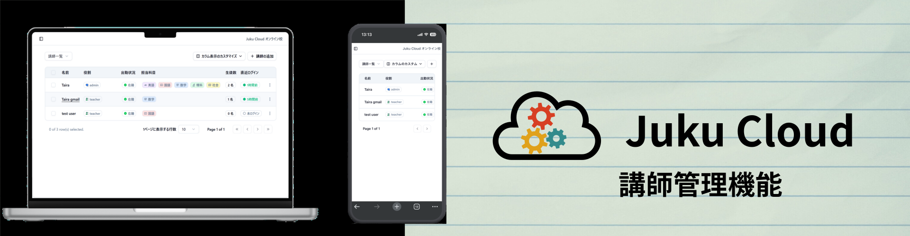
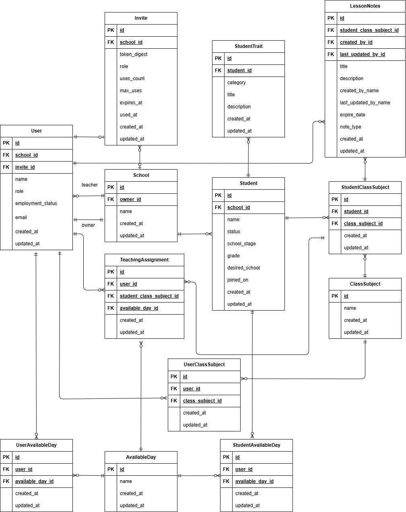

# Juku Cloud

サービスURL: https://www.juku-cloud.com
- フロントエンド: https://github.com/Taira0222/juku-cloud-frontend
- バックエンド: https://github.com/Taira0222/juku-cloud-backend


---

### 生徒一人一人の特性をクラウドで管理できる
個別指導塾を運営するうえで、特に生徒の特性を把握し指導することは非常に重要です。これらは講師たちが潜在的に意識していますが、言語化されることなく属人的なものになりがちです。Juku Cloudは生徒の特性を「いい特性」、「注意する特性」に分類し、クラウド上で一元管理することで、講師間での情報共有を促進し、生徒一人一人に最適な指導を提供することができます。

## 開発背景
私はソフトウェアエンジニアを目指す前、3年間にわたり個別指導塾を経営していました。
学習塾では受験対策や成績向上が最重要ですが、それ以上に、生徒一人ひとりの特性を把握し、最適な指導を行うことが欠かせません。
例えば、理解が不十分でも「わかった」と言ってしまう生徒がいました。そのような生徒には、段階的に理解度を確認しながら教える必要がありました。
一方で、理解力が高く、基礎でつまずかない生徒もいます。その場合は、他の生徒と同じペースではなく、応用的な内容まで進めることで、さらなる成長を促せました。
しかし、こうした「生徒の特性を踏まえた指導」は多くの場合、講師の経験に依存して属人化していました。その結果、情報共有が難しく、指導の質にばらつきが生じていました。
この課題を解決するために開発したのが Juku Cloud です。
Juku Cloudは、生徒の特性を「良い特性」と「注意が必要な特性」に分類し、クラウド上で一元管理します。これにより講師間の情報共有が容易になり、生徒一人ひとりに最適な指導を提供できます。
さらに、授業の引き継ぎ事項を科目ごとに管理できるため、引き継ぎにかかる時間を大幅に削減し、より教育そのものに集中できる環境を実現します。

## ペルソナ
### 対象 1: A さん（塾長・45歳）

- 生徒数：50名の個別指導塾を運営
- ITリテラシー：Excelは使用できるが、SaaS導入経験はなし
- 主な課題：講師5名を雇っているが、生徒の特性や指導方針が属人化しており、授業の質にばらつきがある
- ゴール：品質を維持しながら2教室目を開校したい
- Juku Cloudでの解決：生徒特性や引継ぎ情報をクラウドで共有し、誰が教えても一定品質の指導を実現

### 対象 2: B さん（新規オーナー・30歳）

- 生徒数：20名
- ITリテラシー：Google Driveで資料管理している
- 主な課題：生徒情報が自分の頭の中にあり、アルバイト講師に共有できないため雇用拡大に踏み切れない
- ゴール：講師を採用して1年以内に生徒50名へ拡大したい
- Juku Cloudでの解決：生徒情報を体系的に管理し、引継ぎや方針共有をスムーズにすることで人材育成を効率化

### 対象 3: C さん（大学生講師・20歳）

- 所属：個別指導塾でアルバイト講師として勤務
- ITリテラシー：Google WorkspaceやMicrosoft Officeを日常的に使用
- 主な課題：塾長からの指示が口頭中心で抽象的、生徒ごとの対応に迷うことがある
- ゴール：生徒ごとの注意点や過去の引継ぎを確認し、安心して授業に臨みたい
- Juku Cloudでの解決：特性・引継ぎ情報をリアルタイムに参照でき、授業前の不安を軽減

---

## 主な機能
### MVP
- 生徒管理機能
  - 生徒作成・編集・削除
- 講師管理機能
  - 講師の作成・編集・削除
- ダッシュボード機能
  - 「生徒の特性」の一覧や、授業引き継ぎを科目ごとに参照できる
- 授業の引き継ぎ管理機能
  - 科目ごとに授業の引き継ぎ事項を管理可能
  - 引き継ぎ事項は講師・管理者ともに作成・編集が可能(削除は管理者のみ)
  - 引き継ぎ事項は科目ごとに紐づいているため、科目を削除すると自動で引き継ぎ事項も削除される
  - 引き継ぎ事項は作成日時の降順で表示
  - 
- 生徒の特性管理機能
  - `dashboard`では「いい特性」、「注意する特性」を一覧で確認可能
  - 講師は`dashboard`で生徒の特性の一覧のみ見ることが可能
  - 管理者のみが「特性管理」にアクセス出来て、作成・編集・削除が可能
- 認証機能
  - 招待を受けた講師がメールアドレスとパスワードで登録可能
  - 登録後、講師は自身のアカウントでログイン・ログアウト可能

### ユースケース図


### 生徒管理機能

- 管理者のみ生徒の作成・削除・編集のすべての操作が可能です。
- 管理者・講師ともに、生徒の名前をクリックすると、生徒ごとのダッシュボードに遷移します。

#### 生徒の作成・削除

| 生徒の作成                                    | 生徒の削除 | 
| --------------------------------------------- | ---------- | 
|  |  |


#### 生徒の編集・科目を削除する場合
- 科目を削除する場合、自動で授業引継ぎも削除されるので、確認ダイアログを表示するUIにしています。

| 生徒の編集                                    | 科目を削除する場合 | 
| --------------------------------------------- | ---------- | 
|  |  |


### 講師管理機能

- こちらの機能は管理者のみが利用可能です。
- 講師の作成・編集・削除が可能です。

#### 講師の作成
- トークンを作成し、招待された講師のみが登録できるようにしています。


#### 講師の編集
- 指導している生徒がいる場合、生徒側で講師の解除が必要になるため、直接編集できないようにしています。

| 講師の編集(指導している生徒がいない場合)                                 | 指導してる生徒がいる場合の編集                                                     | 
| ------------------------------------------- | ---------------------------------------------------------------------------------- | 
|  |  | 


#### 講師の削除
- 講師を削除する場合は、自動で生徒の指導担当から外れるようにしています。


### ダッシュボード機能

- 管理者・講師ともに、生徒の名前をクリックすると、生徒ごとのダッシュボードに遷移します。
  - 講師は、自分が指導している生徒のダッシュボードのみ参照可能です。
- ダッシュボードでは「生徒の特性」の一覧や、授業引き継ぎを科目ごとに参照できます。
- スマホ画面の場合は、氏名をタップすると学年、志望校が表示されます。

#### ダッシュボード画面
| ダッシュボード画面(PC)                                          | ダッシューボード(スマホ画面)                                              | 
| --------------------------------------------------------------- | ------------------------------------------------------------------------- | 
|  |  | 

### 授業の引き継ぎ管理機能

- ダッシュボード画面で科目ごとに授業の引き継ぎ事項を参照できます。
- 授業の引き継ぎ事項は講師・管理者ともに作成・編集が可能(削除は管理者のみ)です。

#### 授業引き継ぎ事項の作成
- 講師・管理者ともに、授業の引き継ぎ事項を作成できます。


#### 授業引き継ぎ事項の編集
- 講師・管理者ともに、授業の引き継ぎ事項を編集できます。
- 更新をすると、最終更新者、最終更新日時が更新されます。


#### 授業引き継ぎ事項の削除
- 管理者のみが授業の引き継ぎ事項を削除できます。


### 生徒の特性管理機能

- 管理者のみが「特性管理」にアクセス出来て、作成・編集・削除が可能です。

#### 生徒の特性の作成


#### 生徒の特性の編集
- 編集をすると、最終更新日時が更新されます。


#### 生徒の特性の削除


### 認証機能

- 招待を受けた講師がメールアドレスとパスワードで登録可能です。

| 講師登録機能                                  | ログイン機能                                  | 
| --------------------------------------------- | --------------------------------------------- | 
|  |  | 


| ログアウト                                       | 
| ------------------------------------------------ | 
|  | 


---

## アーキテクチャ概要

Juku Cloudは、フロントエンドとバックエンドを分離したSPA構成のWebアプリケーションです。

- フロントエンド：React + Vite + TypeScript で構築し、S3 + CloudFrontでホスティング。
- バックエンド：Rails 8（APIモード）をECS Fargate上で稼働させ、RDS（PostgreSQL）と接続。
- 認証：devise token auth によるトークン認証を採用。
- CI/CD：GitHub ActionsでECRへのビルド・プッシュ、ECSへのデプロイを自動化。
- インフラ：ECS / RDS / S3 / CloudFront / Route53 / ACM / ALB / Secrets Manager / CloudWatch を利用。

### SPA構成の採用理由

#### UX面
- ペルソナはITリテラシーが高くないため、直感的に操作できるUI/UXが求められる。
- ページ遷移を減らし、一覧→詳細→編集をスムーズに行えるようSPA構成を採用。

#### 技術面
- フロントエンドをReact、バックエンドをRails APIとして分離することで、
  将来的にモバイルアプリなど他クライアントからもAPIを再利用しやすい。
- 静的アセット（S3+CloudFront）で配信し、ハッシュ付き`assets`の長期キャッシュ・
  `index.html`の短期キャッシュを分離管理できる。

#### 運用面
- サーバー側でビューを描画しないため、ECSタスクの負荷が軽減し、コスト面でも有利。

### アーキテクチャー図(概要)

```

[ユーザーのブラウザ]
       ↓
 [CloudFront (S3静的ホスティング)]
       ↓
 [React Frontend]  →  [Rails API (ECS Fargate)]
                                ↓
                         [RDS (PostgreSQL)]

```
---

## 技術スタック
| カテゴリ	技術          |                                                                                             | 
| ---------------------- | ------------------------------------------------------------------------------------------- | 
| フロントエンド         | React 19.2.0 / Vite 7.0.4 / TypeScript 5.8.3                                                | 
| バックエンド           | Ruby 3.4.4 / Ruby on Rails 8.0.3（APIモード）                                               | 
| データベース           | PostgreSQL 15.14                                                                            | 
| 認証                   | devise token auth 1.2                                                                       | 
| 環境構築               | Docker,Devcontainer                                                                         | 
| CI/CD	                 | Github Actions(CloudFront/S3, ECR/ECSデプロイ, OIDC認証）                                   | 
| インフラ               | AWS(ECS / ECR / RDS / CloudFront / S3 / Route53 / ACM / ALB / Secrets Manager / CloudWatch) | 
| テスト                 | Vitest / Testing Library / MSW / RSpec / SimpleCov                                          | 
| 静的解析               | ESLint / Prettier / RuboCop / Bullet / Bundler Audit                                       | 
| その他(フロントエンド) | Tailwind CSS / Shadcn UI / Zustand / TanStack Query / Zod /                | 
| その他(バックエンド)   | Kaminari / Alba / Letter Opener Web                                  | 

### フロントエンド
#### React
- 既存プロジェクトに導入するわけでもなく、これから事業として作ってくアプリで長期視点で安定版ではなく、最新のバージョンを採用しました。
- 高速なビルド・開発環境を提供するViteを採用し、ReactでコンポーネントベースのUIを構築。
- SPAを導入するうえでVueも検討しましたが、以下の点でReactを選択しました。
  - Tailwind CSSとの親和性が高く、UIライブラリ系(shadcn/uiなど)が充実している。
  - TypeScriptとの親和性が高く、型安全な開発がしやすい。
#### Vite
- React Create Appは公式から非推奨となり、Viteが主流となっていることから採用の検討を開始しました。
- React 公式に書いてあるほかのビルドツール(Parcel,Rsbuildなど)と比較してもViteが最も高速であり、`Vitest`との相性もいいため採用しました。
#### TypeScript
- 型安全なコードを書くことで、バグの早期発見・保守性向上を図るために採用しました。
- Zodと組み合わせて、APIレスポンスのバリデーションと型定義を一元管理できます

### バックエンド
#### Ruby
- 長期運用を見据え、安定性よりも将来性を重視して最新バージョンを採用しました。
- 日本で開発された言語ということもあり、ほかの言語と比べて学習コストが低く、個人開発に適していると判断しました。
- オブジェクト指向言語であり、責任分割や設計パターンを適用しやすい点も評価しました。
#### Ruby on Rails (APIモード)
- RailsはRubyの代表的なWebフレームワークで、豊富なライブラリ・コミュニティが存在するため採用しました。
- APIモードを採用することで、フロントエンドとバックエンドを分離し、将来的にモバイルアプリなど他クライアントからもAPIを再利用しやすい構成としました。

### データベース
#### PostgreSQL
MySQLも検討しましたが、以下の理由でPostgreSQLを採用しました。
- 今後の拡張性を考えて、PostgreSQLの方が高度な機能が多く、柔軟なデータ操作が可能。
- 生徒、講師、引継ぎ事項、科目、生徒の特性など、複数テーブルにまたがる整合性が非常に重要であり、PostgreSQLの堅牢なトランザクション管理が有利。
- MySQLの素早い動作よりも、PostgreSQLの正確で壊れないデータ構造の方が重要と判断。

### 認証
#### devise token auth
- `devise_token_auth` を採用し、`access-token` / `client` / `uid` を `LocalStorage`に保持しています。  
- Axios インターセプタで各リクエスト時にヘッダへ付与し、レスポンスヘッダに含まれる新しいトークンを用いてローテーションを行います。  
- サーバ側にセッションを保持しないため Rails APIモードに最適 であり、Cookieベースの認証と比較して CSRF攻撃のリスクを低減 できます。  
- 一方で LocalStorage は XSS に弱いため、CloudFront で CSP（Content Security Policy）を設定して外部スクリプト実行を制限しています。  
  詳細は [こちら](https://github.com/Taira0222/juku-cloud?tab=readme-ov-file#%E3%82%BB%E3%82%AD%E3%83%A5%E3%83%AA%E3%83%86%E3%82%A3) を参照。


### 環境構築
#### Docker
- 開発環境と本番環境の差異を最小化し、一貫した動作環境を提供するために採用しました。  
- Docker Compose により、Rails・PostgreSQL・React の各サービスをコンテナで統合管理。  
- チーム開発時も `docker compose up` だけで環境を再現可能です。
#### Devcontainer
- VS Code 上で自動的に開発環境を構築できるよう、Devcontainer を導入しました。  
- Ruby や Node.js、AWS CLI などをあらかじめイメージに含め、セットアップの手間を最小化しています。
- コンテナ起動時もコマンドが不要で、「コンテナを再度開く」だけで開発環境にアクセスできます。

### CI/CD
#### Github Actions
- GitHub Actions を採用し、コードの変更を自動的にビルド・テスト・デプロイするワークフローを構築しました。  
- バックエンドは ECR への Docker イメージのビルド・プッシュ、ECS へのデプロイ、DBのmigrateを自動化。  
- フロントエンドは S3 へのビルド済みアセットのデプロイと CloudFront キャッシュの最適化を自動化。
### インフラ
#### AWS
- 無料のRenderも検討しましたが、豊富なサービスと高い拡張性を持つAWSを採用しました。
- それぞれのサービスの選定理由については [こちら](https://github.com/Taira0222/juku-cloud?tab=readme-ov-file#%E5%85%A8%E4%BD%93%E3%81%AE%E6%A7%8B%E6%88%90%E3%81%AE%E6%A6%82%E8%A6%81) を参照してください。
### テスト
#### Vitest, Testing Library, MSW
- Jestも検討しましたが、Viteとの親和性が高く、高速なVitestを採用しました。
- React Testing Library、MSWを組み合わせて、単体テストだけではなく、APIモックを利用した結合テストも実施しています。
#### RSpec / SimpleCov
- 以前作成したTodo アプリではMinitestを採用しましたが、テストの網羅性を高めるためにRSpecを採用しました。
- SimpleCovを導入し、コードカバレッジを測定。目標カバレッジ80%以上を設定しています。
### 静的解析
#### ESLint / Prettier
- ESLint と Prettier を組み合わせて、コードの一貫性と可読性を確保しています。
#### RuboCop / Bullet / Bundler Audit
- RuboCopを導入し、コードスタイルと品質を自動的にチェックしています。
- Bullet を導入し、N+1クエリなどのパフォーマンス問題を検出。
- Bundler Audit を使用して、依存関係の脆弱性を定期的にチェックしています。
### その他(フロントエンド)
#### Tailwind CSS
- Shadcn UI を利用するために Tailwind CSS を採用しました。
#### Shadcn UI
- Tailwind CSS をベースにしたコンポーネントライブラリで、今回のような業務アプリに適したUIコンポーネントが豊富に揃っているため採用しました。
#### Zustand
- Context API よりもシンプルなグローバルステート管理が可能で、`useState`ライクな書き方で直感的に扱えて学習コストが低いため採用しました。
#### TanStack Query
- サーバー状態の管理が容易で、データフェッチング・キャッシュ・同期化・更新を効率的に行えるため採用しました。
#### Zod
- バックエンドだけでなく、フロントエンドでもバリデーションを一元管理できるため、一部のスキーマ定義に採用しました。
### その他(バックエンド)
#### Kaminari
- ページネーションを非常に簡単に実装できることがとても魅力的であったため採用しました。
```ruby
# page = params[:page] 
# per_page = params[:per_page] 
students.preload(ASSOCS).order(:id).page(page).per(per_page)
```
#### Alba
- 最初は自作のシリアライザを使用していましたが、Albaを採用することでAPIレスポンスのスキーマを統一的に管理できるようになりました。
#### Letter Opener Web
- 開発環境でメール送信をブラウザ上で確認できるため、採用しました。本番ではSESを使用しています。


---

## ディレクトリ構成
### フロントエンド

```
juku-cloud-frontend/
└─ src/
   ├─ Router/                 # ルーティング/認可（AuthRoute, ProtectedRoute, RoleRoute など）
   ├─ pages/                  # 画面コンポーネント（URL単位）
   ├─ features/               # 機能ごとの内包（auth / students / studentTraits / lessonNotes / teachers ...）
   │  └─ lessonNotes/         # ←代表例
   │     ├─ api/              # API呼び出し
   │     ├─ components/       # フォーム・ダイアログ・テーブル等のUI
   │     ├─ hooks/            # 機能固有のロジック（フォーム状態など）
   │     ├─ mutations/        # TanStack Query のミューテーション
   │     ├─ queries/          # TanStack Query のクエリ
   │     ├─ constants/ key.ts # 定数/クエリキー
   │     ├─ types/            # 型定義（Zod/TS）
   │     └─ test/             # この機能のユニット/結合テスト
   ├─ components/             # 共通UI（shadcn/ui ラップや共通フォーム部品）
   ├─ stores/                 # Zustand ストア
   ├─ queries/                # グローバル汎用クエリ（例：useUserQuery）
   ├─ mutations/              # グローバル汎用ミューテーション（例：useSignOut）
   ├─ api/                    # グローバルAPI（例：userApi, signOutApi）
   ├─ lib/                    # axiosクライアント、エラーハンドラ等の基盤
   ├─ utils/                  # フォーマッタ等のユーティリティ
   └─ tests/                  # MSWサーバ/fixtures、E2E寄りの統合テスト


```

### バックエンド

```
juku-cloud-backend/
├─ app/
│  ├─ controllers/           
│  │  ├─ concerns/           # 共通処理(エラー、認証など)
│  │  └─ v1/                 # APIエンドポイント（V1名前空間＋認証系）
│  ├─ models/                # ドメインモデル（subjects/availability/teaching で責務分割）
│  ├─ queries/               # 検索・一覧用のQueryオブジェクト
│  ├─ serializers/           # APIレスポンスのスキーマ統一（Alba）
│  └─ services/              # 変更を伴うユースケース処理（作成/更新/検証）
├─ config/
│  ├─ environments/          # 環境別設定
│  └─ initializers/          # devise/cors/bullet 等の初期化
├─ db/                       
│  └─ migrate/               # マイグレーション一式
├─ ecs/
│  └─ taskdef.json           # ECSタスク定義（CIでレンダリング）
└─ spec/
   ├─ requests/              # APIリクエストのE2E寄りテスト
   ├─ models/                # バリデーション/関連
   └─ services/              # ユースケース単位の検証

```

---
## インフラ構成図


### 全体の構成の概要
本構成は「フロントエンド（静的ホスティング）」「バックエンド（APIサーバー）」「データベース（RDS）」をAWS上で分離し、CI/CDによりGitHub Actionsから自動デプロイ可能なモダンな構成としています。

セキュリティ・スケーラビリティ・コストのバランスを意識し、最小構成で本番運用に耐えうる設計としています。

### VPC設計
- Public Subnet: ALB・Fargateを配置（外部通信が必要）。
- Private Subnet: RDSを配置し、インターネット非公開。
- Internet Gatewayを介して外部通信を確保。
- NATは未設置。ECSタスクは Public Subnet + Public IP で起動し、Internet Gateway経由で外部通信します。（将来的に Private Subnet 運用へ移行する場合は NAT または必要な VPC エンドポイントを追加予定）

### AZ / リージョン
- 想定ユーザーは日本国内のため、東京リージョンを選択しました。
- アメリカ在住のため、将来的には米国リージョンにもデプロイすることを検討しています。
- AZ が複数あるのはALBを設置するために必要だからで、ECSタスクやRDSは単一AZに配置しています。

### Fargate
- EC2管理不要で（OSパッチ/容量管理が不要）、オートスケールやローリング更新が容易で運用負荷が低い。実務でも採用事例が多いことから、コストをかけてでも習得する価値があると判断し採用しました。
- 今回はコスト面からNATゲートウェイを設置しておらず、ECSタスクのアウトバウンドは IGW（Public IP 付与時）を使用します。本構成では IGW 経由です。
- OIDC(OpenID Connect)認証により、ECSタスクがSecrets ManagerやECRに安全にアクセス可能。IAMロールを細かく分割でき、セキュリティが向上。

### ECR
- プライベートDockerレジストリとしてGitHub Actionsからビルド済みイメージをpushし、ECSがpullするワークフローが標準的であるため採用しました。

### ALB
- 本来のALBの用途は負荷分散ですが、今回はNATゲートウェイを設置していないため以下の用途で利用しています
	- HTTPS終端（ACM）
    ALB でHTTPSが終端するため、ALBとECS間はHTTP通信でOKです
	- 安定エンドポイント
		ECSタスクは停止・起動を繰り返すため、ALBのDNS名を通じて安定的にアクセス可能
	- ヘルスチェック
		ECSタスクのヘルスチェックをALBが担当し、異常なタスクを自動的に切り離します
	
### RDS
- 現時点の授業を鑑みると、RDS Single-AZ構成で十分と判断しました。将来的にMulti-AZに変更することも可能です。

### CloudFront + S3
- 静的ホスティングにより、低コストで高パフォーマンスを実現。
- S3のバケットポリシーでCloudFrontからのアクセスのみ許可することで、セキュリティを強化。
- キャッシュ最適化を実行(ハッシュ付き(assets)は1年、index.htmlはノーキャッシュ)し、パフォーマンスを向上。

### CI/CD（GitHub Actions）
- バックエンド
	- GitHub ActionsからECRへビルド済みイメージをpush。
	- aws-actions/amazon-ecs-render-task-definition + amazon-ecs-deploy-task-definition により、
	- ECSタスク定義の更新～デプロイを自動化。
	- デプロイ後に自動でrails db:migrateを実行するワークフローを構築。

- フロントエンド
	- S3へデプロイし、CloudFrontのキャッシュの最適化(index.htmlはノーキャッシュ、assetsは長期キャッシュ)を自動化。

### セキュリティ
- OIDC(OpenID Connect)連携によりGitHub ActionsからAWSへのアクセスを安全に実現（アクセスキー不要）。
- Secrets ManagerでDBパスワードやRailsのマスターキーを安全に管理。
- セキュリティグループにより、ALB→ECS、ECS→RDSの通信のみ許可。
- S3バケットポリシーでCloudFront経由以外の直接アクセスを拒否。
- CloudFrontでCSP(Content Security Policy)を設定し、XSS攻撃を軽減
   - 安全デフォルト: `default-src 'self'`（外部は原則禁止）
   - スクリプト: `script-src 'self'`（外部実行を遮断、XSS面を縮小）
   - スタイル: `style-src 'self' 'unsafe-inline'`（UI崩れ回避のため暫定許可。段階的に削減予定）
   - 通信先: `connect-src 'self' https://api.juku-cloud.com`（APIのみ許可）
   - 埋め込み禁止: `object-src 'none'` / `frame-ancestors 'none'`
   - その他: `img-src 'self' data: blob:` / `font-src 'self' data:` / `worker-src 'self' blob:` / `form-action 'self'`


---
## ER図
下図は、生徒・講師・授業・特性の関連を中心に設計したER図です。



### Userテーブル
塾内の講師・管理者を表すテーブルです。指導担当情報やログイン認証を管理します。

- `User`は管理者と講師の2つの権限を持ち、`enum` の `role` カラムで区別しています。
- 認証は`Devise Token Auth`を利用し、トークンベースの認証を実装しています。
- 講師・管理者ともに授業を担当でき、`UserClassSubject`や`UserAvailableDay`を介して担当科目・指導可能日を管理します。

#### 管理者（role = admin）
- `owner` として `School` を 1:1 で所有します。
  → 管理者が自分の塾だけを管理できる構成にしています。
- `Invite` テーブルを介して講師（User）を招待できます。

#### 講師（role = teacher）
- `School` テーブルと1対多の関係を持ち、1つの学校に複数の講師が所属できます。

### Studentテーブル
- `Student` は `School` に所属し、`StudentClassSubject` を介して複数の`ClassSubject`を持ちます。
- `Student` は `StudentTrait` を直接持ち、生徒の特性を管理します。
- `LessonNote` の場合は、`StudentClassSubject` を介して科目ごとに引き継ぎ事項を管理します。
- 学年は `小学・中学・高校` の3段階をenumで管理し、`grade` カラムで具体的な学年（1〜3など）を管理します。
- 自作の`validate`で小学1年生〜高校3年生までの範囲を制限しています。

### StudentTraitテーブル
このテーブルでは、指導をするうえで把握しておくべき生徒の特性を管理します。

- `StudentTrait` は `Student` に属し、生徒の特性を管理します。
- `trait_type`はenum で `good`, `careful` の2種類を管理しています。

### LessonNoteテーブル
このテーブルでは、授業の際に必要な引継ぎ事項を管理します。

- `LessonNote` は `Student` とは直接ではなく、`StudentClassSubject` を介して関連しています。
- 講師削除時に履歴を保持するため、DB上では `nullify` を採用しています。
- アプリ側では `created_by` は必須とし、削除後も `created_by_name` に名前を残します。
- `last_updated_by`は任意とし、上記同様に`last_updated_by_name`カラムを追加しています。
- `note_type`はenum で `homework`, `lesson`, `other` の3種類を管理しています。
- `expire_date`はその引継ぎ事項の有効期限を管理し、期限切れの引継ぎ事項はバリデーションで作成・更新できないようにしています。

---
## 設計思想
### ビジョン
- Juku Cloudは、生徒の特性をデータとして可視化し、誰もが一貫した質の高い指導を実現できる教育インフラを目指しています。

### 現場再現性
- 私自身が学習塾を経営者視点でも講師視点でも経験しており、現場のニーズを深く理解した上で設計しています。
- アプリ内で出てくる用語や機能は、実際の塾運営で使われているものをベースにしているので、ユーザーが直感的に理解しやすい設計としています。

### アーキテクチャ原則
- フロントエンドでは機能ごとにディレクトリを分離し、責務を明確化。繰り返し使用する可能性の高いコンポーネントはコンポーネント分割を意識して開発を進めました。
- バックエンドでは、オブジェクト指向設計を意識し、サービス層・クエリ層・シリアライザ層で責務分離。Fat Model/Controllerを回避し、可読性・保守性の向上を図りました。

### データ原則
- ER図を基に、正規化を意識したテーブル設計を実施しました。
- 外部キー制約やインデックスを適切に設定し、データの整合性とクエリパフォーマンスを向上させるよう努めました。
- N+1クエリをBulletで検出し、preloadやjoinsで解消することでパフォーマンスを最適化しました。

### セキュリティ / プライバシー
- 認証にはトークンベースの`devise token auth`を採用し、APIモードの本来あるべきステートレスな設計を実現しました。
- フロントエンド・バックエンド間はACM発行のSSL証明書でHTTPS通信を強制し、通信の安全性を確保しました。
- Secrets Managerで機密情報を安全に管理し、IAMロールの権限も最小限に制限しました。
- CloudFrontでCSPを設定し、XSS攻撃を軽減。script-src 'self'を起点に外部実行面を縮小しています。
- S3バケットポリシーでCloudFront経由以外の直接アクセスを拒否しました。
- テストカバレッジはフロントエンド、バックエンドともに80%以上を目標とし、品質を担保しました。ただし、あくまでも品質向上の手段であり、過度に追求しすぎないよう意識しました。

### スケール / コスト
- ECS Fargate(Single AZ)で運用負荷を最小化しました。
- S3 + CloudFrontで低コスト・高パフォーマンス。
  - キャッシュ戦略で高速配信と確実な反映を両立しました。

### 運用
- Docker + Devcontainer で環境依存を極力排除し、誰でも簡単に開発環境を再現可能にしました。
- GitHub Actions で 静的解析やテスト、ECS/ECR/S3/CloudFrontの一気通貫デプロイを実現しました。


---
## こだわった点

### 技術面

#### フロントエンド

##### Zod を導入してフロントでもバリデーション

[LessonNoteの有効期限バリデーション例](./assets/gif/tech/ZodVaridation.gif)

上記は授業引継ぎを作成する際の有効期限のバリデーションスキーマです。
有効期限って本来は今日以降の日付じゃないとダメですよね？
フロントにはこういったバリデーション機能が備わっていないので、もしZodを使わないとすると自作バリデーションやバックエンド側でのバリデーション実装が必要になります。
ただし、自作バリデーションを実装するとコードが煩雑になるうえに保守性も下がりますし、バックエンド側でバリデーションを実装するとユーザー体験が悪くなります。
そこで、一例ですが以下のような`Zod`スキーマを定義して、フロントエンド側でも有効期限のバリデーションを実装しました。もちろんバックエンド側でも同様にバリデーションを実装しているので、二重の安全策にもなっています。

```TypeScript
// 有効期限のバリデーションスキーマ
export const ExpireDateSchema = z.string().refine(
  (val) => {
    // startOfDay を使用し時間を切り捨てる
    const today = startOfDay(new Date());
    const inputDate = startOfDay(parseISO(val));
    return inputDate >= today;
  },
  {
    message: "有効期限は今日以降の日付を入力してください",
  }
);
```
##### 生徒の新規作成・編集
生徒作成をする際に大変だったポイントは以下の通りです
- 新規作成と編集でフォームの挙動を共通化したい
- 生徒の基本情報に加えて、担当科目(subject_ids)、指導可能日(available_day_ids)、指導の関係性(assignments)など複数の関連情報を一括で管理する必要があった
- 曜日、科目に該当する講師を動的に取得して、担当関係(assignments)を管理する必要があった

###### 新規作成と編集でフォームの挙動の共通化
`Mode` という型を用意して、`Conditional Types`を使用して型を切り替えました。
```TypeScript
export type Mode = "create" | "edit";

export type SchemaByMode = {
  create: typeof createStudentSchema;
  edit: typeof editStudentSchema;
};

// モードに応じて submit の型を切り替える
export type PayloadByMode<M extends Mode> = z.infer<SchemaByMode[M]>;

// modeに応じてDraftの型を切り替える
export type DraftByMode<T extends Mode> = T extends "edit" ? EditDraft : Draft;
```

呼び出すときは、`create` か `edit` を指定します。
```TypeScript
// features/students/components/dialog/CreateStudentDialog.tsx
<StudentForm
  mode="create" // ここでモードを指定
  value={value}
  onChange={setValue}
  onSubmit={() => {
    submit(
      // zod のバリデーションを通ったら mutate を呼ぶ
      (valid) => mutate(valid),
      // zod のバリデーションに落ちたらエラーメッセージをトースト表示
      (msgs) => msgs.forEach((m) => toast.error(m))
    );
  }}
  loading={isPending}
  teachers={teachers}
/>

```


###### 基本情報以外の関連情報の一括管理
まずは、以下が新規作成する際の`useState`の型です。編集にはこれにidが追加されます。
```typescript
export type Assignment = {
  teacher_id: number;
  subject_id: number;
  day_id: number;
};

export type Draft = {
  name: string;
  status: string;
  school_stage: string;
  grade: number | null;
  desired_school: string | null;
  joined_on: string; // YYYY-MM-DD形式の文字列
  subject_ids: number[];
  available_day_ids: number[];
  assignments: Assignment[];
};
```
上記のように、生徒の基本情報に加えて、担当科目(subject_ids)、指導可能日(available_day_ids)、指導の関係性(assignments)など複数の関連情報を一括で管理する必要があります。

そのため、これらを`useState`に入れるために成形するユーティリティ関数を作成しました。

```TypeScript

export const createStudentFormHandlers = <M extends Mode>(
  onChange: OnChange<M>
) => {
  // Draftの型をmodeに応じて切り替え
  type Draft = DraftByMode<M>;

  const handleInputChange =
    (field: keyof Draft) => (e: ChangeEvent<HTMLInputElement>) => {
      onChange((prev) => ({ ...prev, [field]: e.target.value }));
    };

  // 入塾日と通塾状況の際に使用
  const handleSelectChange =
    <T extends keyof Draft>(field: T) =>
    (value: Draft[T]) => {
      onChange((prev) => ({ ...prev, [field]: value }));
    };

  // 学年セレクトの際に使用
  const handleStudentOptionChange = (value: string) => {
    onChange((prev) => {
      if (value === "") return { ...prev, school_stage: "", grade: null };
      const [stage, grade] = value.split("-");
      return { ...prev, school_stage: stage, grade: Number(grade) };
    });
  };

  // 科目・曜日に使用、追加や削除ができる
  const toggleInArray = (key: ToggleableKeys, id: number) => {
    onChange((prev) => ({
      ...prev,
      [key]: toggleValueById(prev[key] ?? [], id),
    }));
  };

  const toggleAssignmentInForm = (a: Assignment) => {
    onChange((prev) => ({
      ...prev,
      assignments: toggleAssignment(prev.assignments ?? [], a),
    }));
  };

  return {
    handleInputChange,
    handleSelectChange,
    handleStudentOptionChange,
    toggleInArray,
    toggleAssignmentInForm,
  };
};

```
上記の関数を使用することで、onChangeを使用して簡単に各フィールドの更新が可能になります。


###### 講師の動的取得
これも、講師と選択した科目・曜日に応じて動的に取得するユーティリティ関数を作成しました。

```TypeScript

export const buildTeachersByTab = (
  teachers: Teacher[],
  selectedSubjectIds: number[],
  allDayIds: readonly number[]
) => {
  // 高速処理できるように Set に変換
  const subjectSet = new Set(selectedSubjectIds);
  // 選択した曜日・科目に応じて、曜日ごとに講師を分類
  const byDay: Record<number, Teacher[]> = {};
  for (const dayId of allDayIds) {
    byDay[dayId] = teachers.filter((t) => {
      // その曜日に勤務していて、かつ選択された科目を指導可能な講師
      const worksThatDay = t.workable_days?.some((d) => d.id === dayId);
      const subjectOK = t.teachable_subjects?.some((s) => subjectSet.has(s.id));
      return worksThatDay && subjectOK;
    });
  }

  return { byDay };
};
```
上記の関数を使用することで、選択した科目・曜日に応じて講師を動的に取得できます。

##### エラーハンドリングの統一
毎回エラーハンドリングを書くのは冗長なので、共通化しました。
まずは、エラーの型定義です
```TypeScript
type Errors = {
  code: string;
  field?: string;
  message: string;
};

type CommonServerError = {
  errors?: Errors[];
};


```
Devise Token Auth は独自のエラーフォーマットを返しますが、それを上記の型に変換して扱うようにしています。

```ruby
# app/controllers/api/v1/auth/registrations_controller.rb
def render_update_error_user_not_found
  render_error!(
    code: "USER_NOT_FOUND",
    message: I18n.t("devise_token_auth.registrations.user_not_found"),
    status: :not_found
  )
end

# render_error! メソッドはエラー表示をするためのメソッドです

```
次に、フロントでのエラーハンドリング共通化を以下のように実装しました。

```TypeScript
// src/lib/getErrorMessage.ts
import { isAxiosError } from "axios";
import { ZodError } from "zod";

type Errors = {
  code: string;
  field?: string;
  message: string;
};

type CommonServerError = {
  errors?: Errors[];
};

export const getErrorMessage = (error: unknown): string[] => {
  if (!error) return ["無効なエラー"];

  // axiosError
  if (isAxiosError<CommonServerError>(error)) {
    const response = error.response?.data;
    const status = error.response?.status;

    if (typeof status === "number") {
      if ([401, 403, 404, 500].includes(status)) {
        return [
          response?.errors?.[0].message || "予期せぬエラーが発生しました。",
        ];
      } else if ([400, 422].includes(status)) {
        return (
          response?.errors?.map((error) => error.message) || [
            "予期せぬエラーが発生しました。",
          ]
        );
      }
    }
  }

  // ZodError
  if (error instanceof ZodError) {
    return ["データ形式が不正です"];
  }
  // 通信エラーなど
  return ["通信エラーが発生しました。"];
};


```
このメソッドを導入するだけで、毎回書いていたエラー処理のわずらわしさを解消できました。


##### カバレッジ80%以上
`npm run test:coverage` 実行結果は以下の通りです。
- stmts(実行文の網羅率): 97.49%
- branch(分岐の網羅率): 91.99%
- func(関数の網羅率): 91.6%
- lines(行の網羅率): 97.49%

#### バックエンド

##### 招待トークンの実装
招待トークンを使用して講師を登録するフローを実装しましたが、その際にトークンの改ざん防止と検索可能性を両立させる必要がありました。

| 方法                        | 強み                     | 弱み                      | 招待トークン用途での向き |
| --------------------------- | ------------------------ | ------------------------- | ------------------------ |
| **HMAC-SHA256**（今回採用） | 改ざん防止、速い、検索可 | 秘密鍵漏洩で終わり        | ◎ 最適                   |
| 単純 SHA256                 | 実装簡単                 | 辞書攻撃されやすい        | ×                        |
| bcrypt/scrypt/argon2        | 総当たり超耐性           | 非決定的 → 検索不可、遅い | △（パスワード向き）      |
| Rails `MessageVerifier`     | 改ざん検出＋署名         | トークン文字列が長くなる  | ○（署名つきリンク向き）  |
| AES 暗号化                  | 復号できる               | 招待トークンは復号不要    | ×                        |

`bycrypt`などの非決定的ハッシュは検索できないため不向きであり、`MessageVerifier`はトークンが長くなるためUX的に不向きと判断し、HMAC-SHA256を採用しました。

```ruby
# app/services/invites/token_generator.rb
module Invites
  class TokenGenerate
    def self.call(school, role: :teacher, expires_at: nil, max_uses: 1)
      raw_token = SecureRandom.urlsafe_base64(32)
      digest = Invite.digest(raw_token)

      Invite.create!(
        token_digest: digest,
        school: school,
        role: role,
        expires_at: expires_at || 7.days.from_now,
        max_uses: max_uses
      )
      raw_token
    end
  end
end

# app/models/invite.rb
class Invite < ApplicationRecord
  .
  .
  .
  # raw_tokenをdigest に変換
  def self.digest(raw_token)
    secret = Rails.application.secret_key_base
    OpenSSL::HMAC.hexdigest("SHA256", secret, raw_token)
  end
end
```

##### `Student`の新規作成・編集の最適化
`Student`の新規作成・編集に関して、関連情報の設定やトランザクション管理をサービスオブジェクトで整理しました。
- `create_service.rb` (`Student` 作成サービス) or `updater.rb` (`Student` 更新サービス)
  - `save_transaction` (`Student` をトランザクション内で保存)
    - `relation_setter` (`Student` の関連情報を設定)

そして、`relation_setter`ではクエリの最適化を意識してupsert_allやdelete_allを活用しました。

```ruby
# app/services/students/relation_setter.rb
def update_student_subject_links!(student_id, subject_ids, now:)
  rows =
    subject_ids.map do |sid|
      {
        student_id: student_id,
        class_subject_id: sid,
        created_at: now,
        updated_at: now
      }
    end
  Subjects::StudentLink.upsert_all(
    rows,
    unique_by: %i[student_id class_subject_id]
  )
  # 残すscs_idsを取得
  keep_link_ids =
    Subjects::StudentLink.where(
      student_id: student_id,
      class_subject_id: subject_ids
    ).pluck(:id)

  # 削除するscs_idsを取得
  to_remove_scs =
    Subjects::StudentLink
      .where(student_id: student_id)
      .where.not(id: keep_link_ids)

  # 関連するlesson_notes を削除
  LessonNote.where(student_class_subject_id: to_remove_scs).delete_all
  to_remove_scs.delete_all
end

```
これ以外にも、`class_subjects_ids`を更新したい場合は`student.class_subjects = subject_ids`を実行することで、関連情報を一括で更新できますが、`ActiveRecord`オブジェクトを大量に生成してしまうため、パフォーマンス面で不利です。


##### エラーハンドリングの統一

バックエンドで毎回エラーハンドリングを書くのは冗長で、ばらつきが出やすいので`concern`で共通化しました。

```ruby
module ErrorHandlers
  extend ActiveSupport::Concern

  included do
    # 500
    rescue_from StandardError do |e|
      raise e if Rails.env.development?

      Rails.logger.error("[500] #{e.class}: #{e.message}")
      Rails.logger.error(Array(e.backtrace).join("\n"))

      render_error!(
        code: "INTERNAL_SERVER_ERROR",
        field: "base",
        message: I18n.t("application.errors.internal_server_error"),
        status: :internal_server_error
      )
    end
    # 404
    rescue_from ActiveRecord::RecordNotFound do |e|
      render_error!(
        code: "NOT_FOUND",
        field: "base",
        # 空文字列の場合にデフォルトメッセージを使う
        message: e.message.presence || I18n.t("application.errors.not_found"),
        status: :not_found
      )
    end
    # 403
    rescue_from ForbiddenError do |e|
      render_error!(
        code: "FORBIDDEN",
        field: "base",
        message: (e.message.presence || I18n.t("application.errors.forbidden")),
        status: :forbidden
      )
    end

    # destroy! 失敗時の例外
    rescue_from ActiveRecord::RecordNotDestroyed do |e|
      render_error!(
        code: "RECORD_NOT_DESTROYED",
        field: "base",
        message: (I18n.t("application.errors.record_not_destroyed")),
        status: :unprocessable_content
      )
    end

    # 422 バリデーションエラー
    rescue_from ActiveRecord::RecordInvalid do |e|
      render_model_errors!(
        e.record,
        status: :unprocessable_content,
        default_code: "VALIDATION_FAILED"
      )
    end
    .
    .
    .
  end
end

# エラーレスポンス例
# HTTPステータス: 422
  "error": {
    "code": "VALIDATION_FAILED",
    "field": "email",
    "message": "メールアドレスを入力してください"
  }

```
この`ErrorHandlers`を`ApplicationController`にincludeするだけで、共通のエラーハンドリングが可能になります。
機能を開発する場合も、エラーを投げることのみを意識すればよくなり、コードの簡潔化と品質向上に寄与しました。

##### カバレッジ80%以上
`bundle exec rspec` 実行結果は以下の通りです。
Line Coverage: 98.19% (759 / 773)
Branch Coverage: 89.52% (94 / 105)

ここまで高いカバレッジを達成できたのは、責務分離を意識して設計したことが大きいです。
#### UI/UX
##### `Student` の作成・編集UI


- 科目はバッジ形式で表示し、選択を解除する際はバッジをクリックするだけでOK
- 科目と曜日を選択するまで講師が表示されないようにして、無駄な情報を排除
- 曜日ごとにタブ切り替えできるようにして、講師の情報量を削減
- 選択された講師は、名前、科目、曜日がわかるようになっていて、これもバッジ形式で表示。

##### 色合いに意図を持たせて直観的に操作できるように

- 生徒の特性は、良い特性は緑、注意すべき特性は黄色で表示
- 授業引継ぎはテーブルの色で直観的に科目がわかるように工夫

---
## 苦労した点

### 個性を共有化する学習塾管理アプリが特殊で評価を受けるか心配だった
ほかのエンジニア志望の型のポートフォリオはBtoCが多くフィードバックをもらいやすい一方で、私のアプリは学習塾を経営していて「あったらいいな。」と思った機能を盛り込んだアプリになります。

なので、エンジニア以外の方にとってはニッチすぎて評価されないのではないか？と心配でしたし、今も評価フェーズではないので心配しています。

エンジニア像って多様なので一概には言えませんが、私が目指すエンジニアは「ユーザーの課題を技術で解決できるエンジニア」なので、ニッチな分野でもユーザーの課題を解決できるアプリを作ることに価値があると信じて開発を進めました。

### React + TypeScript の実装が初めてで常に壁にぶつかった
基礎は学んでいたので、今回の実装に入る際にはどのような技術をつかって実装するかはイメージできていました。
しかし、実際にコードを書き始めると、TypeScriptの型定義やReactのコンポーネント設計で多くの壁にぶつかりました。 
そして、`Tanstack Query` を知る前までは`Zustand` で`server state` を管理していましたが、非効率的であることに気づき、途中から`Tanstack Query` に切り替えました。なので最初に実装した`Teacher` 関連のコードは`Zustand` を使ったままになっています。

### AWS の ECS / Fargate 構成、CDを自力で構築するのが大変だった
学習でAWSの基礎は学んでいましたが、ECS / Fargate構成での本格的なアプリ構築は初めてでした。
特にこういったインフラはどこの何をしているのかがブラックボックスになりやすく、トラブルシューティングに苦労しました。
また、CD構成も初めてで、権限の付与(今回はOIDC認証)やECSタスク定義の更新、デプロイの自動化など、試行錯誤しながら構築しました。

---
## 開発期間 
- 開発期間: 2025年7月10日〜2025年10月14日（約3ヶ月）
- 開発体制: 個人開発
- 担当範囲: 企画 / 設計 / フロント / バックエンド / インフラ / CI/CD


---
## 今後の展望

本番運用するために、最低限以下の機能追加・改善を予定しています。また、その後も継続的に改善を進めていく予定です。

### 機能追加

- マスター権限の実装をして、塾、管理者の管理機能を実装する
- 管理者作成も講師同様に招待トークンで登録できるようにする
- メールアドレス変更・パスワードリセット機能の実装
- 機能ごとに権限を管理者が付与できるように実装する


### 改善
- teachers の queries や mutations を tanstack query に移行して効率的なステート管理を実現する